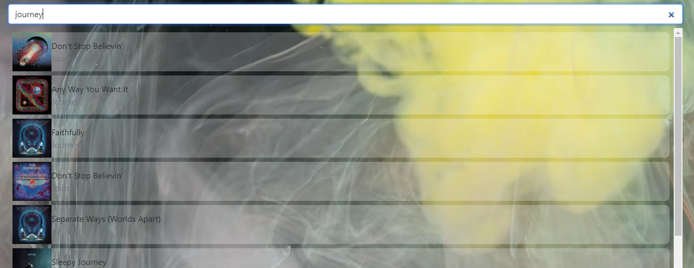
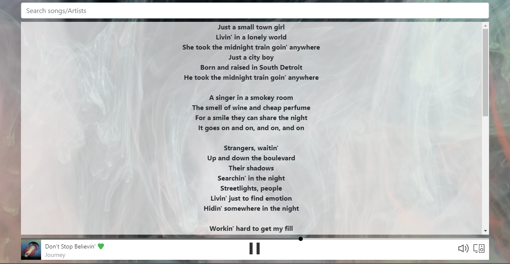

# Monde Green
`Mondegreen [mon·​de·​green | \ ˈmän-də-ˌgrēn\] (definition) - a word or phrase that results from a mishearing of something said or sung. ~ Merriam-Webster`
---

## The Challenge
 
Create a simple karaoke app that helps singers belt out the "correct" song lyrics. Cuz, singing the right notes is hard enough. And if you can't read the lyrics off the screen, then "Hold me close, Tony Danza!"

### CHALLENGE ACCEPTED!
https://monde-green.herokuapp.com/

### Technology & Tools

      

### Future Plans

- add support for non-Pro account users (random song w/ lyrics)
- add song queue
- add auto-play to song queue
- add news blurb about artist/album